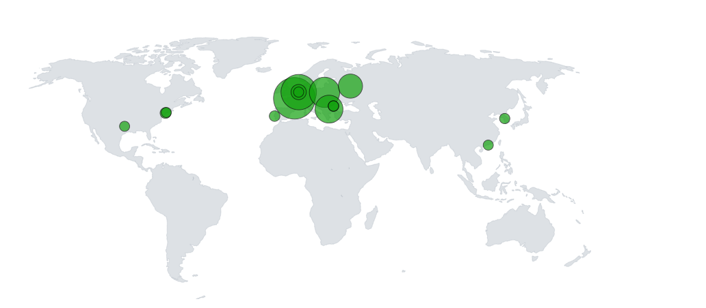
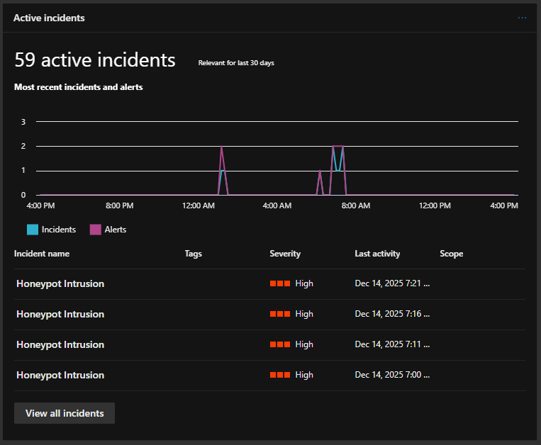
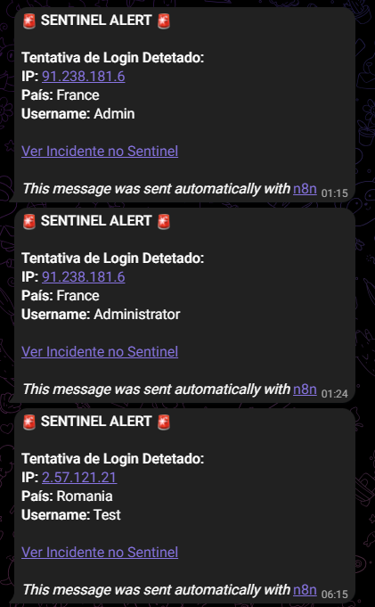
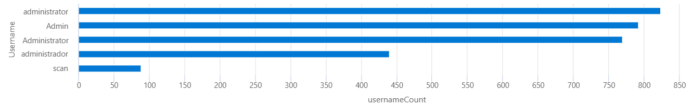
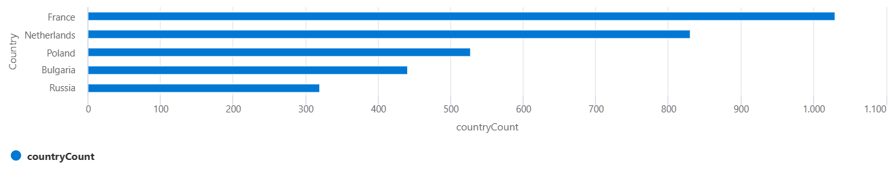
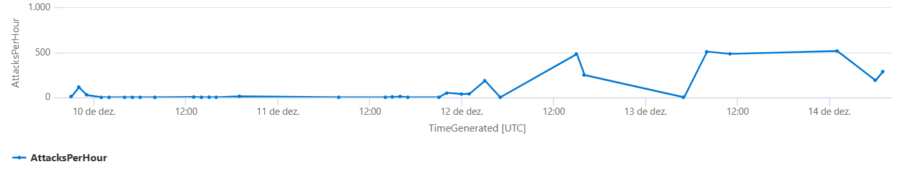

# 🛡️ Azure Sentinel SIEM: RDP Brute Force Honeypot

## Resumo do Projeto
Implementação de um SIEM (Microsoft Sentinel) no Azure conectado a um Honeypot ao vivo. O objetivo foi monitorizar ataques de RDP Brute Force em tempo real, geolocalizar os atacantes e automatizar a resposta a incidentes.

## Estatísticas (5 Dias)
* **Total de Ataques:** 3240
* **Países Top 5:** França, Países Baixos, Polónia, Bulgária e Rússia
* **Usernames mais tentados:** administrator, Admin, Administrator, administrador, scan

## Tecnologias Usadas
* **Azure Sentinel (SIEM)**
* **KQL (Kusto Query Language)**
* **PowerShell** (Extração de Logs e API GeoIP)
* **Azure Logic Apps + n8n** (Automação SOAR)
* **Telegram API** (Alertas em Tempo Real)

## Arquitetura
1. **Ingestão:** VM Windows (Windows Server 2025 Datacenter) exposta à internet (Firewall OFF). Script customizado extrai EventID 4625.
2. **Enriquecimento:** Consulta à API `ipgeolocation.io` para obter Lat/Long/País.
3. **Visualização:** Azure Workbooks traça os pontos no mapa mundo.
4. **Alerta:** Logic App deteta picos de ataque e envia detalhes via Webhook para o n8n/Telegram.

## Visualizações
# Mapa de Ataques

# Sentinel Dashboard

# Telegram Alert

# Top 5 Username

# Top 5 Country

# Mapa de Ataques

